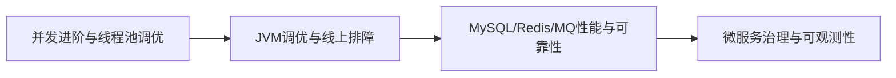

# L2 中级索引：工程与性能

## 阶段目标

- 能定位并解决常见线上性能问题。
- 能在稳定性、复杂度、成本之间做基础权衡。

## 学习路径图

## 模块清单

| 编号 | 主题 | 优先级 | 产出要求 | 状态 |
|---|---|---|---|---|
| 01 | [并发进阶与线程池调优](./01-并发进阶与线程池调优.md) | P0 | 调优策略 + 指标方案 | DONE |
| 02 | [JVM调优与线上排障](./02-JVM调优与线上排障.md) | P0 | 排障流程图 + 案例模板 | DONE |
| 03 | [MySQL-Redis-MQ性能与可靠性](./03-MySQL-Redis-MQ性能与可靠性.md) | P0 | 三件套问题到方案闭环 | DONE |
| 04 | [微服务治理与可观测性](./04-微服务治理与可观测性.md) | P1 | 治理策略 + 观测闭环 | DONE |

## 子章节规划

- 子章节索引：[`00-L2子章节索引.md`](./00-L2子章节索引.md)
- 当前进度：M1~M4 共 18/18 已完成

## 返回

- 进阶入口：[`../README.md`](../README.md)
- 仓库首页：[`../../../README.md`](../../../README.md)
